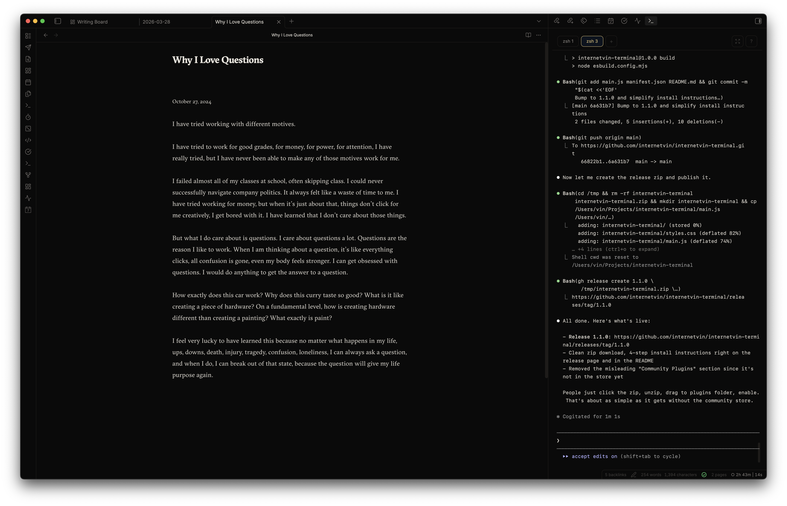

# internetVin Terminal

An embedded terminal for Obsidian with multi-tab support, backlink autocomplete, and drag-and-drop file paths.

> **macOS only.** This plugin uses macOS-specific PTY APIs and will not work on Windows or Linux.

## Features

- **Real PTY terminal** - Full zsh shell running in a real pseudo-terminal, not a basic command runner
- **Multi-tab support** - Open multiple terminal sessions with named tabs
- **Backlink autocomplete** - Type `[[` to get an autocomplete dropdown of your vault notes, just like in the editor
- **Drag and drop** - Drag files from Finder or Obsidian's file explorer into the terminal to paste their paths
- **Screenshot drop** - Drag macOS screenshot thumbnails directly into the terminal (saves to a temp file and pastes the path)
- **Fullscreen mode** - Expand the terminal to fill the entire Obsidian window
- **Session persistence** - Tab names and layout are saved across restarts
- **Keyboard passthrough** - All keystrokes go to the terminal. Cmd+key combos still work for Obsidian shortcuts

## Installation

### With BRAT (recommended, auto-updates)

1. Install the [BRAT plugin](https://github.com/TfTHacker/obsidian42-brat) from Obsidian's community plugins
2. Open BRAT settings and click **Add Beta plugin**
3. Enter `internetVin/internetvin-terminal` and click Add Plugin
4. Enable the plugin in Settings > Community Plugins

### Manual

1. Download **internetvin-terminal.zip** from the [latest release](https://github.com/internetVin/internetvin-terminal/releases/latest)
2. Unzip it
3. Drag the `internetvin-terminal` folder into your vault's `.obsidian/plugins/`
4. Restart Obsidian, then enable the plugin in Settings > Community Plugins

## Usage

Open the terminal from the command palette: search for "internetVin Terminal" or use the ribbon icon.

- Click **+** to open a new tab
- Double-click a tab name to rename it
- Type `[[` to search your vault notes from the terminal
- Drag files onto the terminal to paste their shell-escaped paths

## Requirements

- macOS (desktop only)
- Python 3 (used for PTY management, included with macOS)
